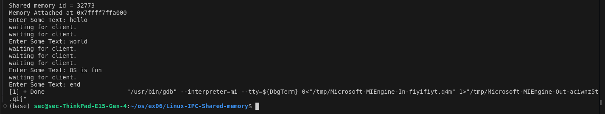
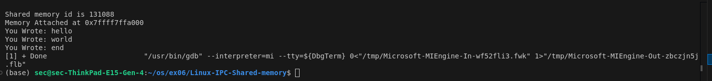
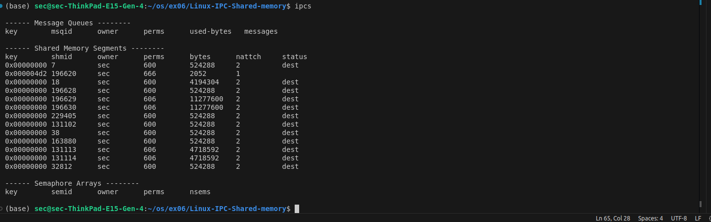

# Linux-IPC-Shared-memory
Ex06-Linux IPC-Shared-memory

# AIM:
To Write a C program that illustrates two processes communicating using shared memory.

# DESIGN STEPS:

### Step 1:

Navigate to any Linux environment installed on the system or installed inside a virtual environment like virtual box/vmware or online linux JSLinux (https://bellard.org/jslinux/vm.html?url=alpine-x86.cfg&mem=192) or docker.

### Step 2:

Write the C Program using Linux Process API - Shared Memory

### Step 3:

Execute the C Program for the desired output. 

# PROGRAM:

## Write a C program that illustrates two processes communicating using shared memory.
```
shmry1.c

#include <unistd.h> 
#include <stdlib.h> 
#include <stdio.h> 
#include <string.h> 
#include <sys/shm.h>
#include <stdint.h>  // For uintptr_t

#define TEXT_SZ 2048 

struct shared_use_st {
    int written_by_you;
    char some_text[TEXT_SZ];
};

int main() {
    int running = 1;
    void *shared_memory = (void *)0; 
    struct shared_use_st *shared_stuff; 
    int shmid;
    
    srand((unsigned int)getpid()); 

    // Create shared memory
    shmid = shmget((key_t)1234, sizeof(struct shared_use_st), 0666 | IPC_CREAT);
    printf("Shared memory id is %d \n", shmid);

    if (shmid == -1) {
        fprintf(stderr, "shmget failed\n");
        exit(EXIT_FAILURE);
    }

    // Attach the shared memory
    shared_memory = shmat(shmid, (void *)0, 0);
    if (shared_memory == (void *)-1) {
        fprintf(stderr, "shmat failed\n");
        exit(EXIT_FAILURE);
    }

    // Print address of the shared memory safely using %p or uintptr_t
    printf("Memory Attached at %p\n", shared_memory);
    // Alternatively, use uintptr_t for printing as a number:
    // printf("Memory Attached at %lx\n", (unsigned long)(uintptr_t)shared_memory);

    shared_stuff = (struct shared_use_st *)shared_memory;
    shared_stuff->written_by_you = 0;

    while (running) {
        if (shared_stuff->written_by_you) {
            printf("You Wrote: %s", shared_stuff->some_text);
            sleep(rand() % 4);  // Random sleep between 0 to 3 seconds
            shared_stuff->written_by_you = 0;

            if (strncmp(shared_stuff->some_text, "end", 3) == 0) {
                running = 0;
            }
        }
    }

    // Detach from shared memory
    if (shmdt(shared_memory) == -1) {
        fprintf(stderr, "shmdt failed\n");
        exit(EXIT_FAILURE);
    }

    // Remove shared memory
    if (shmctl(shmid, IPC_RMID, 0) == -1) {
        fprintf(stderr, "failed to delete shared memory\n");
        exit(EXIT_FAILURE);
    }

    exit(EXIT_SUCCESS);
}

shmry2.c

#include<unistd.h> 
#include<stdlib.h> 
#include<stdio.h> 
#include<string.h>
#include<sys/shm.h>
#define TEXT_SZ 2048 
struct shared_use_st{
int written_by_you;
char some_text[TEXT_SZ];
};
int main()
{
int running =1;
void *shared_memory = (void *)0; 
struct shared_use_st *shared_stuff; 
char buffer[BUFSIZ];
int shmid;
shmid	=shmget(	(key_t)1234,	sizeof(struct shared_use_st), 0666 | IPC_CREAT);
printf("Shared memory id = %d \n",shmid);
if (shmid == -1)
{
fprintf(stderr, "shmget failed\n"); exit(EXIT_FAILURE);
}
shared_memory=shmat(shmid, (void *)0, 0);
if (shared_memory == (void *)-1){
fprintf(stderr,	"shmat	failed\n"); exit(EXIT_FAILURE);}
printf("Memory Attached at %p\n",shared_memory); 
shared_stuff = (struct shared_use_st *)shared_memory; 
while(running)
{
while(shared_stuff->written_by_you== 1)
{
sleep(1);
printf("waiting for client.	\n");
}
printf("Enter Some Text: "); fgets (buffer, BUFSIZ, stdin);
strncpy(shared_stuff->some_text, buffer, TEXT_SZ);
shared_stuff->written_by_you = 1;
if(strncmp(buffer, "end", 3) == 0){
running = 0;}}
if (shmdt(shared_memory) == -1)
{
fprintf(stderr, "shmdt failed\n"); exit(EXIT_FAILURE);
} exit(EXIT_SUCCESS);
}

```
## OUTPUT
## ./shmry2.o

## ./shmry1.o

## ipcs


# RESULT:
The program is executed successfully.
